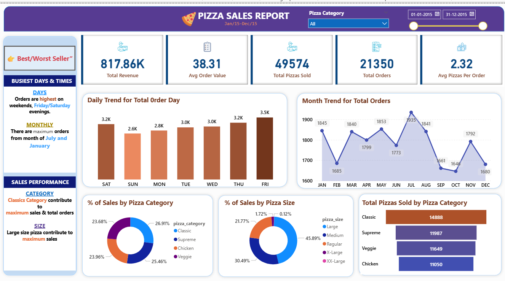
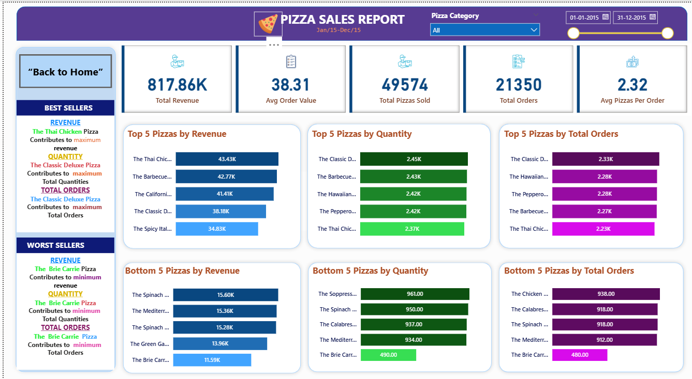

# 🍕 **Pizza Sales Analysis using SQL & Power BI**

This project provides analytical insights into **pizza sales performance** using **Microsoft SQL Server** and **Power BI**.  
It highlights key sales trends, performance metrics, and top-selling pizzas through interactive visual dashboards.

---

## 🖼️ **Dashboard Preview**

### 🔹 Overall Sales Dashboard


### 🔹 Best & Worst Sellers Dashboard


> 📊 *These dashboards visualize key KPIs such as total revenue, orders, pizza category sales, and top-performing pizzas.*

---

## 🎯 **Project Objectives**
- Analyze total revenue, total orders, and average order value  
- Identify top and bottom-performing pizzas by revenue and quantity  
- Study daily and monthly sales trends  
- Evaluate sales distribution across pizza categories and sizes  
- Support business decisions for improving pizza sales  

---

## 🧰 **Tools & Technologies Used**
| Tool / Technology | Purpose |
|--------------------|----------|
| **SQL Server** | Data querying and KPI calculation |
| **Power BI Desktop** | Dashboard creation and visualization |
| **Microsoft Excel** | Data cleaning and preprocessing |
| **Power Query & DAX** | Data modeling and transformation |

---

## 📊 **Dashboard Features**
1. **KPI Cards** – Total Revenue, Total Orders, Avg. Order Value, Pizzas Sold  
2. **Sales Trend Analysis** – Daily and Monthly order trends  
3. **Sales by Category and Size** – Breakdown by pizza type and size  
4. **Top & Bottom 5 Pizzas** – Based on revenue, quantity, and orders  
5. **Dynamic Filters** – Analyze results for specific months or categories  

---

## 📈 **Key Insights**
- 🍕 **Classic pizzas** generated the highest revenue overall  
- 📅 **Friday and Saturday** had the most orders per week  
- 🧾 **Medium size** pizzas were the most popular choice  
- 💰 **Thai Chicken Pizza** was the top-selling pizza by revenue  
- 📊 **February** showed strong performance for "Veggie" and "Supreme" categories  

---

## 🧮 **SQL Queries Used**

```sql
-- Total Revenue
SELECT SUM(total_price) AS Total_Revenue FROM pizza_sales;

-- Average Order Value
SELECT (SUM(total_price) / COUNT(DISTINCT order_id)) AS Avg_Order_Value FROM pizza_sales;

-- Total Pizzas Sold
SELECT SUM(quantity) AS Total_Pizzas_Sold FROM pizza_sales;

-- Total Orders
SELECT COUNT(DISTINCT order_id) AS Total_Orders FROM pizza_sales;

-- Average Pizzas per Order
SELECT CAST(SUM(quantity) AS DECIMAL(10,2)) / 
       CAST(COUNT(DISTINCT order_id) AS DECIMAL(10,2)) AS Avg_Pizzas_Per_Order
FROM pizza_sales;
📅 Trend Analysis Queries

Daily Trend for Orders:

SELECT DATENAME(DW, order_date) AS Order_Day,
       COUNT(DISTINCT order_id) AS Total_Orders
FROM pizza_sales
GROUP BY DATENAME(DW, order_date);


Monthly Trend for Orders:

SELECT DATENAME(MONTH, order_date) AS Month_Name,
       COUNT(DISTINCT order_id) AS Total_Orders
FROM pizza_sales
GROUP BY DATENAME(MONTH, order_date);

💡 Performance Insights
Metric	Description	Example Output
Total Revenue	Sum of all pizza sales	₹817,860
Total Orders	Number of unique customer orders	21,350
Total Pizzas Sold	Total pizzas sold	49,574
Avg. Order Value	Average revenue per order	₹38.31
Avg. Pizzas per Order	Avg. pizzas per customer order	2.32
🧑‍💻 Author

Md Sahanwaj Khan
🎓 Master of Computer Applications (MCA)
🏫 Galgotias College of Engineering and Technology
